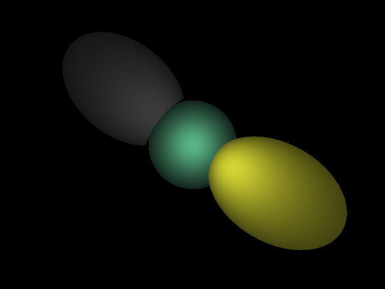

# RayTracing
This is a implementation of ray tracing algorithm.
A lot of fun!

To save the RGBA values into an image file, I used the [lodePNG](http://lodev.org/lodepng) library.
To calculate the intersection between rays and spheres, I referred [this](https://www.siggraph.org/education/materials/HyperGraph/raytrace/rtinter1.htm).

